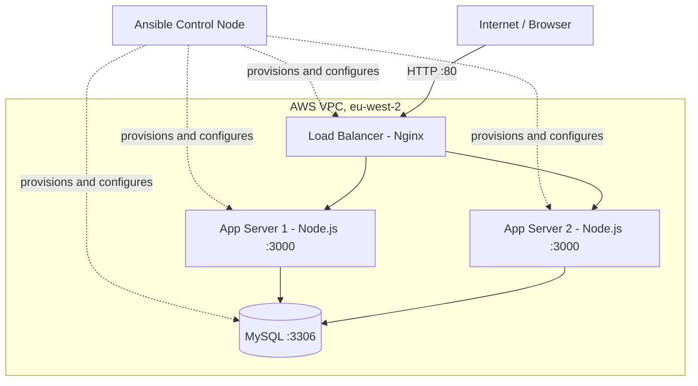

# Multi-Tier Web Application on AWS — Deployed with Ansible


A load-balanced, fault-tolerant web application running on AWS EC2, provisioned and configured end-to-end with **Ansible** — no manual server setup. Two Node.js app servers sit behind an Nginx load balancer and share a MySQL database. Every layer (packages, services, configuration, and secrets) is managed declaratively by Ansible roles and validated in CI.

> A hands-on infrastructure-as-code project demonstrating Ansible roles, templates, handlers, runtime facts, and Vault on real AWS infrastructure.

## Architecture



A client reaches only the load balancer, over port 80. Nginx distributes requests across the two app servers over the VPC's private network, and both app servers read and write to the same MySQL instance. If one app server stops responding, Nginx automatically routes around it.

## Tech stack

- **AWS EC2** — 4 × Ubuntu instances (1 load balancer, 2 app servers, 1 database)
- **Ansible** + **Ansible Vault** — configuration management and secret encryption
- **Nginx** — reverse proxy / load balancer
- **Node.js + Express** — application
- **MySQL** — database
- **GitHub Actions** — CI running `ansible-lint` on every push

## Highlights

- **Load balancing** — Nginx spreads traffic across two identical Node.js app servers.
- **Automatic failover** — verified live by stopping a server; Nginx serves everything from the healthy one with no downtime.
- **Shared database** — every request is logged to MySQL and the app displays a running visit total that climbs regardless of which server answers, proving both app servers share one backend.
- **Fact-driven configuration** — the Nginx upstream block and the app's database connection are generated from private IPs Ansible discovers at runtime, never hardcoded.
- **Secret management** — the database password is encrypted with Ansible Vault and injected into the app through a root-only (`0600`) environment file.
- **Idempotent** — re-running the playbook changes nothing unless real drift has occurred.
- **CI-linted** — every push is checked with `ansible-lint`, using modern fully-qualified module names and clean YAML.

## Project structure

```
ansible-aws-webapp/
├── .github/
│   └── workflows/
│       └── lint.yml              # CI: runs ansible-lint on every push
├── .ansible-lint                 # lint configuration
├── ansible.cfg
├── site.yml                      # top-level playbook
├── inventory/
│   └── hosts.ini                 # servers grouped by tier
├── group_vars/
│   └── all/
│       ├── vars.yml              # non-secret variables
│       └── vault.yml             # encrypted secrets (Ansible Vault)
└── roles/
    ├── common/                   # base packages on every host
    ├── database/                 # MySQL, schema, and app user
    ├── webserver/                # Node.js, the app, systemd service
    └── loadbalancer/             # Nginx reverse proxy (templated upstream)
```

## Prerequisites

- An AWS account with 4 running Ubuntu EC2 instances, tagged `Role=lb`, `Role=web` (× 2), and `Role=db`
- A security group allowing SSH (22) from your IP, HTTP (80) from anywhere, and internal traffic between the instances
- Ansible on your control machine
- The MySQL collection: `ansible-galaxy collection install community.mysql`

## Usage

Clone the repository:

```bash
git clone https://github.com/SagarGi/ansible-aws-webapp.git
cd ansible-aws-webapp
```

1. **List your servers** in `inventory/hosts.ini` under the matching group:

   ```ini
   [loadbalancer]
   <lb-public-ip>

   [webservers]
   <web1-public-ip>
   <web2-public-ip>

   [database]
   <db-public-ip>
   ```

2. **Point `ansible.cfg` at your SSH key** (`private_key_file`).

3. **Provide the Vault password** — create a `.vault_pass` file referenced in `ansible.cfg`, or pass `--ask-vault-pass` on each run.

4. **Deploy:**

   ```bash
   ansible-playbook site.yml
   ```

5. **Test the load balancer** — hit its public IP a few times and watch the hostname alternate and the visit count climb:

   ```bash
   for i in {1..8}; do curl -s http://<lb-public-ip>; echo; done
   ```

## Ansible concepts demonstrated

Inventory and host grouping · ad-hoc commands · playbooks · roles · variables (group_vars and role defaults) · loops · facts and `hostvars` · handlers and `notify` · Jinja2 templates · Ansible Vault · privilege escalation · idempotency · fully-qualified module names (FQCN).

## Possible improvements

This is a learning project, not a production deployment. What I would add next:

- **Network isolation** — move the app servers and database into private subnets with no public IPs, leaving only the load balancer public-facing.
- **True high availability** — the load balancer and database are currently single points of failure; production would use a managed load balancer and database replication.
- **Dynamic inventory** — replace the static IP list with the `amazon.aws.aws_ec2` plugin so servers are discovered automatically from their tags.
- **Conditionals** — branch on `ansible_facts` to support multiple Linux families (e.g. `apt` vs `dnf`).
- **Containerised variant** — package the app with Docker and have Ansible orchestrate the containers.

## Author

Built by [Sagar](https://github.com/SagarGi) as a practical study of Ansible-driven infrastructure on AWS.